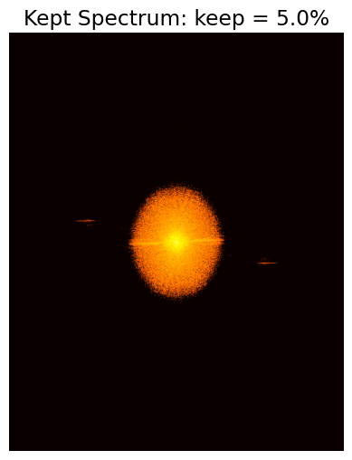
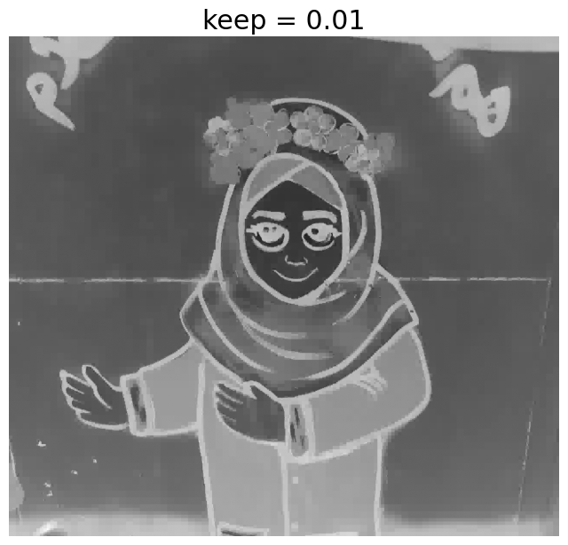

# Transform-Based Image Processing

This project demonstrates image compression techniques using two fundamental transforms: the Discrete Wavelet Transform (DWT) and the Fast Fourier Transform (FFT). It provides Jupyter notebooks and sample assets to visualize, experiment with, and understand the effects of these transforms on image compression and reconstruction.

In this project, two sample images are used: `sample1.jpg`, which is a standard image to visualize the compression process, and `sample2.jpg`, which is a brain MRI image.

| Sample 1 | Sample 2 |
|----------|----------|
|  |  |


## Features
- **DWT Image Compression:**
  - Visualizes DWT coefficients and their partitioning.
  - Demonstrates image compression by thresholding or partitioning DWT coefficients.
  - Shows the effect of coefficient manipulation on reconstructed images.
- **FFT Image Compression:**
  - Visualizes magnitude and phase of FFT.
  - Demonstrates compression by manipulating FFT magnitude.
  - Shows the effect of magnitude changes on image reconstruction.
- **Sample Assets:**
  - Includes example images and results for both DWT and FFT methods.

## Directory Structure
```
assets/
  DWT/         # DWT sample images and results
  FFT/         # FFT sample images and results
FFT_magnitude.ipynb                # FFT magnitude analysis notebook
Sample1_DWT_Image_Compression.ipynb # DWT compression notebook (Sample 1)
Sample1_FFT_Image_Compression.ipynb # FFT compression notebook (Sample 1)
Sample2_DWT_Image_Compression.ipynb # DWT compression notebook (Sample 2)
Sample2_FFT_Image_Compression.ipynb # FFT compression notebook (Sample 2)
Transform-Based-Image-Processing (DWT and FFT Image Compression).pdf # Project report
```

## Requirements
- Python 3.x
- numpy
- matplotlib
- imageio
- scikit-image (skimage)
- Jupyter Notebook

Install dependencies with:
```bash
pip install numpy matplotlib imageio scikit-image jupyter
```

## Usage
1. **Clone the repository and navigate to the project directory.**
2. **Launch Jupyter Notebook:**
   ```bash
   jupyter notebook
   ```
3. **Open and run the notebooks:**
   - `Sample1_DWT_Image_Compression.ipynb` and `Sample2_DWT_Image_Compression.ipynb` for DWT-based compression.
   - `Sample1_FFT_Image_Compression.ipynb`, `Sample2_FFT_Image_Compression.ipynb`, and `FFT_magnitude.ipynb` for FFT-based compression and analysis.
4. **Explore the `assets/` directory** for sample images and results.

## Results
- DWT: See `assets/DWT/` for original, coefficient, and compressed images.
- FFT: See `assets/FFT/` for original, magnitude, and compressed images.


## Sample2 FFT Compressed Images and Magnitude

Below is a table displaying the compressed images from `Sample2_FFT_Image_Compression.ipynb` and their corresponding FFT magnitude visualizations. Each compressed image is shown above its magnitude plot.

| Compressed Image | Magnitude Plot |
|:----------------:|:--------------:|
|  |  |
|  |  |
|  |  |

*Each compressed image is directly above its corresponding FFT magnitude plot. Images are located in `assets/FFT/`. Update the filenames as needed to match your actual results.*


## Sample1 DWT Compressed Images

Below is a table displaying the original, DWT coefficients, and compressed images from `Sample1_DWT_Image_Compression.ipynb`. All images are located in `assets/DWT/`.

| Original Image | DWT Coefficients | Compressed Image |
|:--------------:|:----------------:|:----------------:|
|  |  |  |

*Update the filenames as needed to match your actual results. The images above illustrate the DWT process for Sample 1: the original image, its wavelet coefficients, and the final compressed output.*


## License
This project is licensed under the MIT License. See the [LICENSE](LICENSE) file for details.
